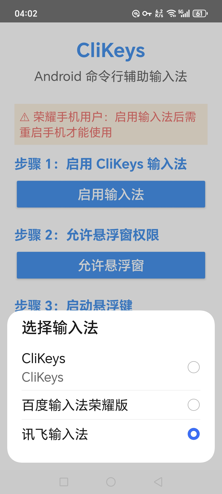
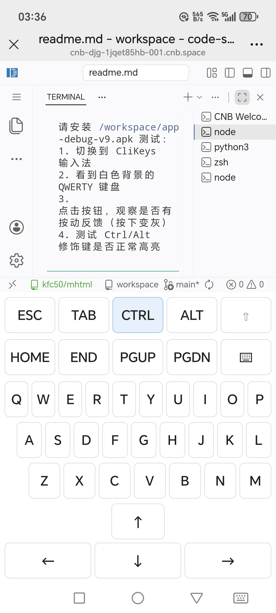

# CliKeys - Android Ctrl/Esc 键盘

手机使用ctrl和Esc键的键盘app。主要用于解决以下问题:

1. 比如在cloudflare workers在线网页代码编辑器上全选代码；
2. 还有cnb.cool上的vscode code server网页版里安装codebuddy cli这种交互式命令行ai agent，使用/config时候会需要用户按Esc键退出的问题，还有在各种网页版 shell / terminal等等需要tab补全代码的问题。

主要用于应急使用，因为手机只能选择一个键盘使用，该键盘样式比较丑 。

Using Ctrl and Esc keys

## 应用截图

### App 主页



### 键盘页面



---

## 功能特性

- **Ctrl 键**：切换模式，按下后高亮，此时按字母键即发送 Ctrl+字母（如 Ctrl+C、Ctrl+V、Ctrl+A 等）
- **Esc 键**：发送 Escape 键
- **Alt 键**：切换模式，配合字母键发送 Alt+字母
- **Shift 键**：切换模式，配合字母键发送大写字母
- **Tab 键**：发送 Tab 键（用于命令行补全）
- **方向键**：上、下、左、右
- **Home/End/PgUp/PgDn**：光标移动键
- **完整 QWERTY 键盘**：支持 26 个字母键输入

## 安装说明

1. 从 [Releases](https://github.com/Map9876/android-ctrl-esc-keyboard-app/releases) 下载最新 APK 文件
2. 在手机上安装 APK（需要允许安装未知来源应用）
3. 打开 App，按照步骤操作：
   - **步骤 1**：启用 CliKeys 输入法（设置 → 语言和输入法 → 勾选 CliKeys）
   - **步骤 2**：切换键盘（点击按钮调出系统输入法选择器）

**注意**：荣耀手机用户启用输入法后需要重启手机才能使用。

## 使用方法

1. 打开任意输入框（如浏览器搜索框、终端应用等）
2. 点击屏幕底部导航栏最右侧的"键盘"图标
3. 选择"CliKeys"
4. 输入法从屏幕底部弹出，显示完整键盘

~~### 悬浮窗模式（可选）~~

~~1. 在 App 主页点击"允许悬浮窗"授予权限~~
~~2. 点击"启动悬浮键"启动悬浮窗~~
~~3. 悬浮窗显示在屏幕右上角，点击展开修饰键面板~~
~~4. 按住面板顶部灰色横条可拖动面板位置~~

> **注**：悬浮窗模式已移除。因为手机同时只能使用一个输入法，悬浮窗无法与输入法同时使用，因此该功能已删除。

## 使用场景

### 场景 1：Cloudflare Workers 在线代码编辑器

在手机浏览器上使用 Cloudflare Workers 的在线代码编辑器时，需要全选代码（Ctrl+A）进行复制或编辑。使用 CliKeys 输入法，按下 Ctrl 键后按 A 键即可发送 Ctrl+A 全选命令。

### 场景 2：CNB.cool VS Code Code Server

在 cnb.cool 上的 VS Code Code Server 网页版里安装 CodeBuddy CLI 这种交互式命令行 AI Agent，使用 `/config` 命令时会需要用户按 Esc 键退出。使用 CliKeys 输入法，直接点击 Esc 按钮即可。

### 场景 3：网页版 Shell/Terminal

在各种网页版 Shell/Terminal 中，需要 Tab 键补全代码。使用 CliKeys 输入法，点击 Tab 按钮即可触发命令补全。

## 项目主页

GitHub: https://github.com/Map9876/android-ctrl-esc-keyboard-app

---

## 开发者指南：Tag、Release 和 GitHub Actions 的关系

### 关系图

```
开发者写代码 (git commit)
       ↓
推送到 GitHub (git push origin main)
       ↓
GitHub Actions 自动构建 ← 每次 push 到 main 都会触发
       ↓
创建版本号标记 (git tag v1.0.X)
       ↓
推送 tag 到 GitHub (git push origin v1.0.X)
       ↓
GitHub Actions 再次触发 ← 检测到 tag push
       ↓
构建 APK (assembleDebug)
       ↓
自动创建 Release 页面 ← 包含 APK 下载链接
       ↓
用户下载 APK 安装使用
```

### Tag 与 Commit 的关系

**一个 tag 可以对应多次 commit push**，后面的 APK 会覆盖前面的。

```
git commit -m "功能A" && git push origin main  ← 触发构建
git commit -m "功能B" && git push origin main  ← 再次触发构建
git tag v1.0.5 && git push origin v1.0.5       ← Release 只包含最新代码
```

> **注意**：GitHub Actions 每次 push 到 main 都会构建，但只有 push tag 时才会创建 Release。同一个 tag 只能对应一个 Release，多次 commit push 到 main 后再 push tag，Release 里的 APK 是最新代码编译的。

### 一键发布命令（复制粘贴即可）

#### 方法 1：发布新版本（推荐）

```bash
# 1. 修改代码后，提交更改
git add -A
git commit -m "你的更新说明"

# 2. 推送到 GitHub
git push origin main

# 3. 创建新版本 tag（修改版本号）
git tag v1.0.3

# 4. 推送 tag 触发自动构建和发布
git push origin v1.0.3
```

#### 方法 2：快速发布（一步到位）

```bash
# 修改版本号 v1.0.X，然后复制粘贴执行
git add -A && git commit -m "release: v1.0.3" && git push origin main && git tag v1.0.3 && git push origin v1.0.3
```

#### 方法 3：删除旧 tag 重新发布

```bash
# 如果需要重新发布某个版本
git push origin --delete v1.0.3
git tag -d v1.0.3
git tag v1.0.3
git push origin v1.0.3
```

### 查看发布结果

- **构建状态**：https://github.com/Map9876/android-ctrl-esc-keyboard-app/actions
- **下载 APK**：https://github.com/Map9876/android-ctrl-esc-keyboard-app/releases

### 常见问题

| 问题 | 原因 | 解决方法 |
|------|------|----------|
| Tag 推送失败 | 仓库规则限制 | 检查 Settings → Rules → Rulesets |
| Release 创建失败 | Release immutability 开启 | 关闭该选项 |
| Actions 没触发 | workflow 没有 tags 触发条件 | 确保 build.yml 包含 `tags: - 'v*'` |
| APK 没上传成功 | Release 不可变 | 删除 Release 后重新推送 tag |

---

## AI 开发提示词

说明: 以下是ai开发的prompt提示词:

```
你好，请帮我创建一个安卓app，这个app是一个键盘，键盘上面有ctrl按键，和Esc按键，还有方向键，还有tab按键，这样我就可以在手机的网页上进行全选代码，比如在cloudflare workers在线网页代码编辑器上全选代码，还有cnb.cool上的vscode code server网页版里安装codebuddy cli这种交互式命令行ai agent，使用/config时候会需要用户按Esc键退出的问题，还有在各种网页版 shell / terminal等等需要tab补全代码的问题。
```

---

## 许可证

本项目为开源项目，欢迎使用和修改。
